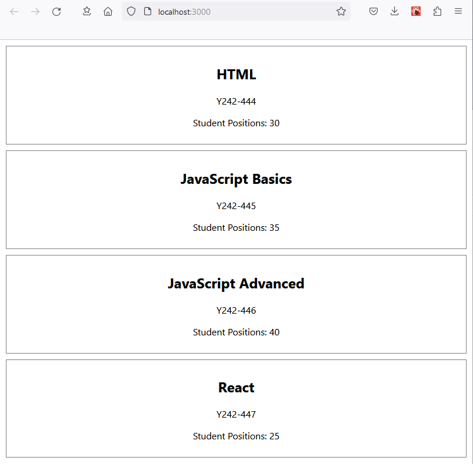

[](https://classroom.github.com/a/d92x1vy6)
# Week Exercise 2

To goal of this exercise is to practise and demonstrate you skills in react component usage, passing and using object data to components via props.

How to start:

- should clone this project to your own computer with git,
- install the dependecies with 'npm install',
- write the solution for the task,
- test it on your machine with 'npm test' and confirm that you pass all the test cases,
- Finally commit and push your changes to the github classroom repository

The outcome of a working application should look like in the example image below:


## Task description

Task is to create a react application to present a list of courses offered by a school, club or similar organization.

The application should present a list of courses available. The list should work with any number of courses. Each course should have a name, course id and number of how many student positions are available.

Each course should be styled with padding 10px, margin 10px, text align center and a 1px gray solid border.

No interactivity is required. Only rendering of the courses is required.

The App component receives the course data as prop named "courses", the data type of the prop is an array of objects called as course objects. The course objects have three properties

- name - string
- courseId - string
- studentPositions - number

The App component should render an component called "CourseList". The course list is reponsible of rendering all the courses. The app component passes the course data to CourseList via prop called "courses". This prop is identical to the "courses" prop of the App component. So App component just forwards the courses it receives to the CourseList.

The CourseList component should receive the courses and render one "Course" component for each course in the courses array. The CourseList component will give the course name, course id and student positions as individual props to the Course component it renders.
The Course components should be rendered on top of each other.

The Course component is responsible of rendering an individual course.
The Course component should accept three props:

- name - string
- courseId - string
- studentPositions - number

The Course component should render the following DOM structure.
```
<div className="course">
      <h2>{name}</h2>
      <p>{courseId}</p>
      <p>Student Positions: {studentPositions}</p>
    </div>
```
## Available Scripts

In the project directory, you can run:

### `npm start`

Runs the app in the development mode.\
Open [http://localhost:3000](http://localhost:3000) to view it in your browser.

The page will reload when you make changes.\
You may also see any lint errors in the console.

### `npm test`

Launches the test runner in the interactive watch mode.\
See the section about [running tests](https://facebook.github.io/create-react-app/docs/running-tests) for more information.

